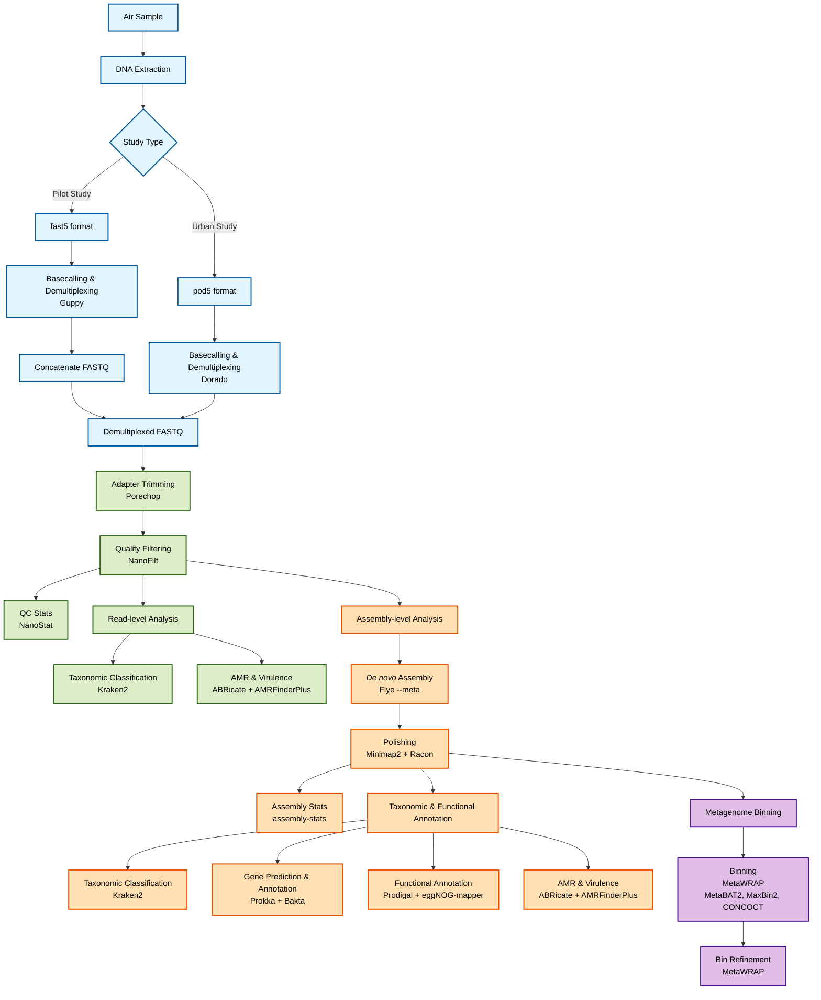

# Air Monitoring by Nanopore Sequencing (PRJNA1063692)

## Project Overview

This project uses metagenomic analysis of bioaerosols collected via air sampling to monitor microbial communities, employing Oxford Nanopore Technologies (ONT) sequencing. This repository contains a workflow designed to process raw sequencing data, perform assembly and binning, and conduct detailed taxonomic and functional analysis.

**ENA Project Link:** [https://www.ebi.ac.uk/ena/browser/view/PRJNA1063692](https://www.ebi.ac.uk/ena/browser/view/PRJNA1063692)

> A polished personal overview of this first-author pipeline is maintained in [Tim_Reska](https://github.com/ttmgr/Tim_Reska/tree/main/pipelines/aerobiome). Use this group repository for study-specific data access notes, helper scripts, and execution context.

---

## Analysis Pipeline Overview



---

## ** Important First Step: Data Access & Preprocessing**

Before running the main pipeline, you **must** consult the specific data guide for the dataset you are analyzing. These guides contain critical, non-optional instructions for accessing the correct raw data and preparing your FASTQ files.

* **Greenhouse vs. Natural Environment Study (Pilot Study):** [`pilot_study_sample_guide.md`](./pilot_study_sample_guide.md)
    * **Data Format:** Raw `.fast5` files.
    * **Processing:** Requires **Guppy** for basecalling and demultiplexing.
    * **Action Required:** FASTQ files for Natural Environment samples **must be concatenated** before use.

```bash
guppy_basecaller -i /path/to/input/fast5/ -r -s /path/to/output/ --detect_barcodes -c dna_r10.4.1_e8.2_400bps_hac.cfg
```

* **Urban Air Study:** [`urban_study_sample_guide.md`](./urban_study_sample_guide.md)
    * **Data Format:** Raw `.pod5` files.
    * **Processing:** Requires **Dorado** for basecalling and demultiplexing.

```bash
dorado basecaller dna_r10.4.1_e8.2_400bps_hac@v5.0.0 -r /path/to/input/pod5/ --emit-fastq > basecalled.fastq --kit-name SQK-RBK114-24 --no-trim
```

**The main pipeline assumes you have already completed the steps in the relevant guide and have your demultiplexed FASTQ files ready in a single input directory.**

---

## Repository Structure

* **`/bash_scripts`**: Contains the modular, automated bash pipeline. The main `run_pipeline.sh` script orchestrates the entire workflow.
* **`/config`**: Contains configuration files such as `config.yaml` with parameters for the pipeline tools.
* **`/env`**: Contains the `environment.yaml` required for creating the conda environment.
* **`/Python_Scripts`**: Contains the consolidated Python script (`metagenomics_analysis.py`) for post-pipeline data analysis and report generation.
* **`/Taxonomic_and_functional_annotation`**: Provides detailed guides comparing and explaining the various tools used for taxonomic classification, functional annotation, and AMR gene detection.
* **`Installation_tutorial.md`**: A step-by-step guide for installing all required tools and their dependencies.
* **`pilot_study_guide.md` & `urban_study_sample_guide.md`**: Essential guides for initial data access and preparation.

---

## Installation & Setup

1.  **Install Tools**: For detailed installation instructions for all pipeline tools and their dependencies, please refer to the **[`Installation_tutorial.md`](./Installation_tutorial.md)** file. It is highly recommended to use `mamba` to create a dedicated environment.

2.  **Download Databases**: Before running the pipeline, you must download the necessary databases. A helper script is provided to automate this process.
    ```bash
    # This will download several hundred GB of data
    bash bash_scripts/download_databases.sh
    ```
    **Important:** You **must** edit the `DB_BASE_DIR` variable within this script to your desired storage location. After downloading, update the database paths in `bash_scripts/run_pipeline.sh`.

---

## Usage Workflow

This repository provides two ways to run the pipeline: a fully interactive user-friendly wrapper, or manual modular script execution.

### Option A: Interactive Quick Start (Recommended)
To immediately begin processing your data without manually editing configuration files:
1. **Activate your environment** (Ensure Conda/Docker tools are active).
2. **Run the Interactive Wrapper:**
    ```bash
    bash run_pipeline.sh
    ```
3. **Follow the Prompts** to provide your FASTQ directory, desired output path, threads, and necessary downstream database paths.

### Option B: Manual Configuration and Execution
If you prefer to run the pipeline in headless mode or execute individual stages step-by-step using the modular scripts, follow these instructions.

### 1. Configure the Pipeline

Open the main pipeline script, **`bash_scripts/run_pipeline.sh`**, and edit the **User Configuration** section at the top. You must set the correct paths for:

* `OUTPUT_BASE_DIR`: The main directory where all analysis results will be saved.
* `INPUT_FASTQ_DIR`: The directory containing your preprocessed, demultiplexed FASTQ files.
* `THREADS`: The number of CPU threads to use.
* Database Paths: `KRAKEN2_DB_PATH`, `AMRFINDER_DB_PATH`, etc. These should match the locations from the `download_databases.sh` script.

### 2. Run the Automated Pipeline

Execute the main pipeline script from the root of the repository. It will automatically run all analysis stages in the correct order.

```bash
bash bash_scripts/run_pipeline.sh
```

The pipeline will perform the following stages sequentially. You can also run these independently if you prefer manual control:

1.  **Read Processing**: Trims adapters, filters reads, generates QC stats, and performs taxonomic classification on reads.
    ```bash
    bash bash_scripts/01_read_processing.sh
    ```
2.  **Assembly & Polishing**: Assembles reads into contigs and polishes them for accuracy.
    ```bash
    bash bash_scripts/02_assembly_and_polishing.sh
    ```
3.  **Metagenome Binning**: Groups contigs into Metagenome-Assembled Genomes (MAGs).
    ```bash
    bash bash_scripts/03_binning.sh
    ```
4.  **Functional Annotation**: Predicts genes and annotates functions for both reads and assemblies, including AMR gene screening.
    ```bash
    bash bash_scripts/04_annotation.sh
    ```

### 3. Post-Pipeline Analysis & Reporting

After the main pipeline is complete, use the consolidated Python script to summarize results and generate a final report.

```bash
# Example: Generate the final HTML report
python Python_Scripts/metagenomics_analysis.py create_report \
  --input_dir /path/to/your/processing_directory/ \
  --output_file FINAL_REPORT.html
```

For more details on summarizing specific results (e.g., Kraken2 reports, NanoStat metrics), refer to the README within the `Python_Scripts` directory.

---

## Tools Integrated

This pipeline integrates the following key bioinformatics tools:
* **Basecalling**: Guppy / Dorado
* **Read Processing**: Porechop, NanoFilt
* **Assembly**: Flye, Minimap2, Racon
* **Binning**: MetaWRAP (MetaBAT2, MaxBin2, CONCOCT)
* **Quality Control**: CheckM, NanoStat, Assembly-stats
* **Taxonomic Classification**: Kraken 2
* **Annotation**: Prodigal, Prokka, Bakta, eggNOG-mapper
* **AMR/Virulence**: ABRicate, AMRFinderPlus
* **Utilities**: Seqkit

 
  
 
