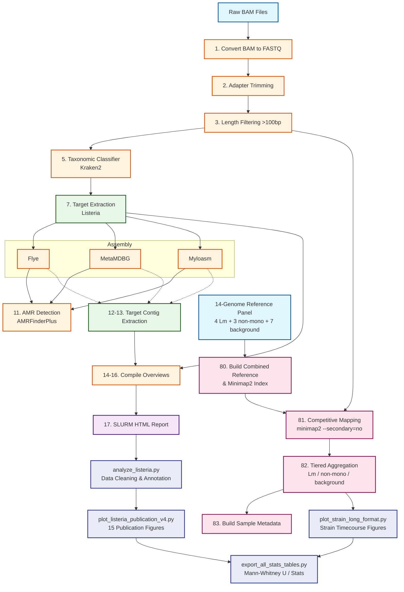

# A metagenomic framework for rapid *Listeria monocytogenes* surveillance in food production environments

This repository contains a full analysis workflow for Oxford Nanopore sequencing data, focused on *Listeria* detection and characterization from mixed microbiome samples.

It is designed for high-performance computing batch execution (SLURM), but can also be run locally for smaller tests.

---

## Why this matters for food safety
*Listeria monocytogenes* is a foodborne pathogen that can survive in food-processing environments and cause severe disease. Rapidly detecting *Listeria* signal directly from sequencing data, without needing days of cell culturing, helps food safety teams act faster during contamination checks and outbreak investigations.

## What is Adaptive Sampling?
Adaptive sampling is a real-time enrichment approach during Nanopore sequencing. As DNA passes through a sequencing pore, the instrument basecalls the first part of the read, compares it to a target reference, and decides to either:
- **Keep** sequencing the read if it looks like target DNA.
- **Eject** the read early if it looks off-target.

This drastically increases the sequencing yield for targets of interest (like *Listeria*) without the need for complex physical enrichment in the wet lab before sequencing.

## The Goal: Benchmarking AS vs Native (N) Sequencing
The original use-case for this pipeline is directly comparing **Adaptive Sampling (AS)** against **Native (N)** (un-enriched) sequencing runs of the same samples.

The pipeline is explicitly designed to handle datasets where each sample was run both ways. It outputs aggregated comparisons on:
- **Total Yield vs Length Dropout**: Analyzing how the read length filter differentially affects AS versus N yields due to the target ejection mechanics.
- **Target Enrichment Percentage**: Measuring the relative abundance of the target organism compared to the total microbiome background in AS versus N.
- **Assembly Quality**: Comparing the length and coverage of final target-specific contigs when assembled from AS-enriched reads versus N reads.

If your dataset contains matched pairs (e.g. `barcode01_AS` and `barcode01_N`), the pipeline will automatically group them in the final HTML report and generate direct side-by-side distribution plots.

---

## Pipeline Architecture



---

## Quick Start

### 1) Create Environment with Mamba
```bash
mamba create -n listeria_as \
  python=3.10 \
  samtools porechop nanofilt nanostat kraken2 seqtk seqkit \
  flye metamdbg myloasm minimap2 racon ncbi-amrfinderplus \
  pandas numpy scipy matplotlib \
  -c conda-forge -c bioconda --strict-channel-priority

mamba activate listeria_as
```

### 2) Install Dorado Basecaller & Polisher
Dorado must be installed manually outside of Mamba. See [docs/01_installation.md](docs/01_installation.md) for full instructions on downloading the binary and models.

### 3) Run Orchestrator

1. **Clone the repo** and enter it.
2. **Edit path variables** in `scripts/submit_pipeline.sh` (replace `/path/to/project` with your real paths).
3. **Run the orchestrator script:**
    ```bash
    bash scripts/submit_pipeline.sh
    ```
    This orchestrator submits and links the full workflow (steps 1 to 20), and gracefully skips outputs that have already been generated.

---

## Documentation Table of Contents

We have broken down the pipeline documentation into specific guides to make it easier to digest:

1. **[Installation and Setup](docs/01_installation.md)**
   - How to install Mamba and set up the Conda environment.
   - Where to download the Kraken2 and AMRFinderPlus databases.
   - Official documentation links for all tools used.

2. **[Pipeline Workflow and Architecture](docs/02_pipeline_steps.md)**
   - A step-by-step breakdown of what every script (`01` through `22`) accomplishes.
   - An explanation of the specific command-line flags used in the tools.

3. **[Execution and Troubleshooting Guide](docs/03_execution_guide.md)**
   - How to run the pipeline on a SLURM high-performance cluster.
   - How to manually execute steps locally.
   - Common errors (e.g., missing Kraken DBs) and fast checks.

4. **[Adapting the Pipeline](docs/04_adapting_pipeline.md)**
   - How to use the `sample_metadata_template.csv` to map barcodes to real sample conditions.
   - How to easily change the target regex logic to extract **Salmonella**, **E. coli**, or any other organism instead of *Listeria*.

5. **[Statistical Analysis and Publication Figures](docs/05_project_notes.md)**
   - Lessons learned and project history from building this pipeline.

---

## Strain-Level Competitive Mapping (Steps 80-83)

The core strain-level analysis uses competitive mapping against a 14-genome reference panel to resolve reads to individual strains. This is designed for SLURM HPC execution.

### Reference Panel (14 genomes)

| Tier | Species |
|------|---------|
| **L. monocytogenes** (4) | EGDe, LL195, LMNC326, N13-0119 |
| **Non-mono Listeria** (3) | L. innocua J5051, L. ivanovii Nr26, L. welshimeri Nr14 |
| **Background** (7) | E. coli, P. mirabilis, Y. enterocolitica, Y. frederiksenii, S. aureus, R. equi, P. aeruginosa |

### Strain Mapping Workflow

```
Reference FASTAs (14 genomes)
        |
        v
  80_prepare_background_refs.sh    -- Combine FASTAs, build minimap2 index, strain map
        |
        v
  81_strain_mapping_background.sh  -- Competitive mapping per sample (SLURM array)
        |                             minimap2 --secondary=no → per-strain stats
        v
  82_strain_summary_background.py  -- Aggregate into tiered summary CSVs
        |
        v
  83_build_metadata_v3.py          -- Build sample_metadata.csv from master sheet
```

### Running the Strain Analysis

```bash
# Step 80: Build combined reference + minimap2 index
sbatch scripts/80_prepare_background_refs.sh

# Step 81: Competitive mapping (one job per sample)
sbatch --array=1-N scripts/81_strain_mapping_background.sh

# Step 82: Aggregate results
WORK_DIR=/path/to/project python scripts/82_strain_summary_background.py

# Step 83: Build metadata
python scripts/83_build_metadata_v3.py
```

### Outputs

- `strain_proportions_master_5.csv` — Long-format table (one row per sample x strain)
- `strain_summary_by_condition_5.csv` — L. monocytogenes summary by AS/N condition
- `nonmono_summary_by_condition_5.csv` — Non-mono Listeria summary
- `background_summary_by_condition_5.csv` — Background species summary
- `mismapping_control_5.csv` — Negative control mismapping estimates

---

## Statistical Analysis & Publication Figures

After the main pipeline and strain mapping finish, a set of Python scripts handles downstream statistical analysis and publication figure generation. These scripts live in the same `scripts/` directory and operate on the pipeline's output data.

### Analysis Workflow

```
Pipeline output (listeria_reads.csv / .xlsx)
        |
        v
  analyze_listeria.py          -- Data cleaning, filtering, annotation
        |
        v
  plot_listeria_publication_v4.py  -- 15 publication-quality figures (PNG/PDF/SVG)
        |
        v
  export_all_stats_tables.py   -- Consolidated statistical test summary
        |
        +---> export_mwu_docx.py           -- Mann-Whitney U results to DOCX
        +---> build_mwu_excel.py           -- MWU results to Excel workbook
        +---> export_results_summary_sheet.py  -- Summary statistics sheet

Strain mapping output (strain_proportions_master_5.csv)
        |
        v
  plot_strain_long_format.py   -- Strain-level timecourse & swab-type figures + MWU tests
```

### Key Analysis Scripts

| Script | Description |
|--------|-------------|
| `listeria_pipeline_common.py` | Shared constants: strain lists, timepoint mappings, categorical columns, path helpers |
| `analyze_listeria.py` | End-to-end analysis from raw CSV/XLSX to final annotated Excel table |
| `plot_listeria_publication_v4.py` | Generates 15 figures comparing AS vs Native across metrics (proportions, total reads/bases, strain detection) |
| `plot_strain_long_format.py` | Strain-level timecourse and swab-type comparison figures from 14-genome competitive mapping |
| `plot_fig5_with_baseline.py` | Combined panel figure generation |
| `build_metagenomics_master_combined_csv.py` | Parses workbook sheets into a clean combined metagenomics CSV |
| `add_listeria_xlsx_sheets.py` | Adds derived Quasimetagenomics and Metagenomics sheets to the master Excel |
| `run_pi_revision_round_v2.py` | Orchestrates the full analysis pipeline in sequence (analyze -> plot -> export) |

### Running the Analysis

```bash
# Full pipeline (recommended)
python scripts/run_pi_revision_round_v2.py \
    --input data/listeria_final_corrected_v2.xlsx \
    --sheet Data \
    --output-root outputs/pi_revision_v2

# Or run individual steps
python scripts/analyze_listeria.py --input data/listeria_reads.csv --output-root outputs/
python scripts/plot_listeria_publication_v4.py --input outputs/listeria_final_table.xlsx --output-root outputs/publication_v4
```

### Statistical Methods

- **Mann-Whitney U tests** for AS vs Native comparisons (non-parametric, unpaired)
- **Spearman rank correlations** for timepoint trends
- **Kruskal-Wallis omnibus tests** for swab-type differences
- All figures use colourblind-safe palettes (Okabe-Ito)

---

## Final Note
If you only change one thing before running: make sure **every placeholder path** is replaced with real paths for your system. Most failed runs come from path mismatches!

---

## Citation
If you use this pipeline, please cite:

> Muchaamba F, Reska T, Biggel M, Locken KM, Weilguny L, Corti S, Kelbert L, Roger S, Urban L. *A metagenomic framework for rapid Listeria monocytogenes surveillance in food production environments.* [bioRxiv, 2026](https://www.biorxiv.org/content/10.64898/2026.04.23.720354v1). DOI: [10.64898/2026.04.23.720354](https://doi.org/10.64898/2026.04.23.720354)
