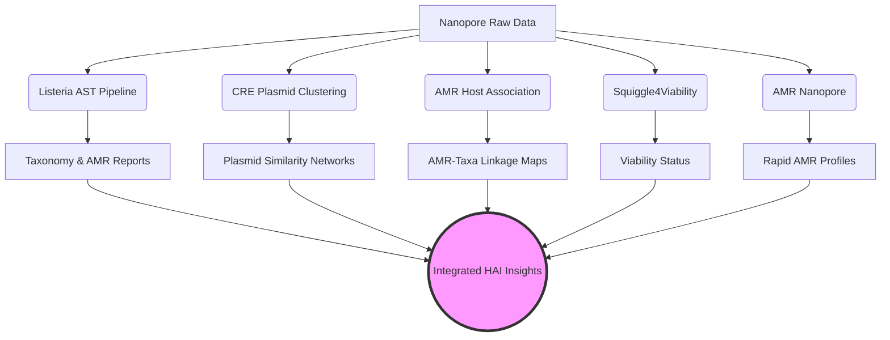

<div align="center">
  
# 🔬 HAI-Pipelines

**A Comprehensive Bioinformatics Pipeline Collection for Healthcare-Associated Infections (HAI)**

[]()
[]()
[](https://opensource.org/licenses/MIT)

*Developed at the Helmholtz Institute / Lab*

</div>

---

## 📖 Overview

The **HAI-Pipelines** repository is a centralized, modular collection of bioinformatics workflows developed to address the growing challenge of **Healthcare-Associated Infections (HAIs)** and **Antimicrobial Resistance (AMR)**. Designed for the analysis of Nanopore sequencing data, this repository integrates multiple specialized pipelines into a cohesive, reproducible ecosystem.

Our tools leverage long-read sequencing technology to provide rapid, high-resolution insights into pathogen genomics, enabling detailed epidemiological tracking, resistome profiling, and plasmid characterization.

## 🧬 Integrated Pipelines

This repository currently hosts three distinct, yet complementary, analytical pipelines:

### 1️⃣ [Listeria Adaptive Sampling Pipeline](./Listeria-Adaptive-Sampling/README.md)
*High-resolution genomic analysis of Listeria monocytogenes from complex samples.*

**Key Capabilities:**
*   **Adaptive Sampling Processing:** Optimized for nanopore adaptive sampling runs.
*   **Taxonomic Profiling:** utilizing Kraken2 for rapid community characterization.
*   **Metagenomic Assembly:** High-quality assembly using MetaFlye and polishing with Dorado.
*   **AMR Profiling:** Comprehensive detection of antimicrobial resistance genes via AMRFinderPlus.
*   **Automated Reporting:** Generates detailed HTML and Excel reports summarizing sequencing metrics, taxonomy, and resistance profiles.

### 2️⃣ [CRE Plasmid Clustering Pipeline](./CRE-Plasmid-clustering/README.md)
*Advanced characterization and clustering of plasmids in Carbapenem-resistant Enterobacterales (CRE).*

**Key Capabilities:**
*   **Plasmid Reconstruction:** Specialized workflows for resolving complex plasmid structures from long-read data.
*   **Comparative Genomics:** Tools for clustering and comparing plasmid sequences across isolates.
*   **Epidemiological Tracking:** Facilitates the study of plasmid-mediated dissemination of carbapenem resistance genes.

### 3️⃣ [Nanopore AMR Host Association Pipeline](./Nanopore-AMR-Host-Association/README.md)
*Direct linking of antimicrobial resistance genes to their bacterial hosts in metagenomic samples.*

**Key Capabilities:**
*   **Long-read Metagenomics:** Exploits the length of nanopore reads to span across repetitive genomic elements.
*   **Host-Resistance Linkage:** Bioinformatic linking of AMR gene annotations (e.g., from AMRFinderPlus) with taxonomic classifications (e.g., from Kraken2) on the same individual reads or assembled contigs.
*   **Resistome Contextualization:** Provides critical context for understanding the mobility and potential clinical impact of identified resistance elements.

### 4️⃣ [Squiggle4Viability Pipeline](./Squiggle4Viability/README.md)
*Assessing bacterial viability directly from raw nanopore electrical signals.*

**Key Capabilities:**
*   **Signal-level Analysis:** Bypasses basecalling by analyzing the raw "squiggle" data (FAST5/POD5) directly.
*   **Viability Determination:** Distinguishes between live and dead bacterial cells based on subtle signal differences indicating membrane integrity or metabolic state prior to sequencing.
*   **Rapid Diagnostics:** Enables faster and more direct insights into treatment efficacy and infection viability status.

### 5️⃣ [AMR Nanopore Pipeline](./AMR_nanopore/README.md)
*Rapid and robust detection of Antimicrobial Resistance directly from nanopore sequencing data.*

**Key Capabilities:**
*   **Real-time Analysis:** Optimized for the continuous, real-time nature of nanopore sequencing.
*   **Comprehensive AMR Profiling:** Identifies a wide range of resistance determinants across diverse bacterial pathogens.
*   **Actionable Insights:** Designed to produce rapid reports suitable for clinical or epidemiological decision-making.

---

## 🚀 Getting Started

To utilize these pipelines, clone the repository to your local environment:

```bash
git clone https://github.com/ttmgr/HAI-Pipelines.git
cd HAI-Pipelines
```

### Dependencies
Each sub-pipeline maintains its own specific dependencies, managed via Conda/Mamba or Docker. Please refer to the specific setup instructions within each pipeline's directory:

*   [Listeria Setup Guide](./Listeria-Adaptive-Sampling/docs/01_installation.md)
*   [CRE-Plasmid Setup Guide](./CRE-Plasmid-clustering/README.md)
*   [AMR-Host Setup Guide](./Nanopore-AMR-Host-Association/README.md)

---

## 📊 Workflow Architecture



*(Note: The pipelines can be run independently or their outputs combined for comprehensive sample characterization.)*

---

## 🤝 Contributing

We welcome contributions to improve and expand the HAI-Pipelines collection! 

1. Fork the repository.
2. Create your feature branch (`git checkout -b feature/AmazingFeature`).
3. Commit your changes (`git commit -m 'Add some AmazingFeature'`).
4. Push to the branch (`git push origin feature/AmazingFeature`).
5. Open a Pull Request.

---

## 📝 License

Distributed under the MIT License. See `LICENSE` for more information.

---

<div align="center">
  <i>"Empowering rapid response to infectious threats through advanced genomic surveillance."</i>
</div>
