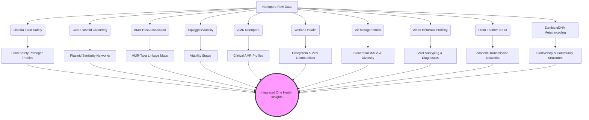

<div align="center">
  
# GenomicsForOneHealth
**A Bioinformatics Pipeline Collection for Genomic Surveillance & One Health**

[]()
[]()
[](https://opensource.org/licenses/MIT)

*Developed by the One Health group under the supervision of [Lara Urban](https://sites.google.com/view/urban-lab/home)*

</div>

---

## Overview

Using Nanopore technology and AI, we contribute to developing genomic surveillance strategies at the intersection of human, animal, and environmental health to empower our understanding of pathogens, their transmission, drug resistance, and virulence—in the context of food safety, water and air quality, and human clinical monitoring. Our research embraces the interdisciplinarity of One Health, and spans applications in the clinical, veterinarian, and environmental setting. By integrating portable technology and real-time AI analysis, we try to leverage genomics wherever it is needed—to improve health globally and holistically.

We are based at the University of Zurich and its Food Safety and One Health Institutes, with affiliations to the Helmholtz AI Institute. Our research has, amongst others, been funded by the German Ministry of Research, UK Research and Innovation, the New Zealand Department of Conservation, the European Union’s Horizon Europe, and the German Helmholtz Association.

As a signatory of the San Francisco Declaration on Research Assessment, we support fair and responsible research assessments and therefore discourage the inappropriate use of proxies such as journal impact factors.

Learn more about our work at the [Urban Lab website](https://sites.google.com/view/urban-lab/home).

### Our Team
- **Dr. Lara Urban**: Principal Investigator & Supervisor (Helmholtz AI & University of Zurich)
- **Dr. Albert Perlas** (former Postdoc): Virome and Avian Influenza Virus (AIV) 
- **Tim Reska** (PhD Student): Metagenomics (Air and Wetland)
- **Daniel Gygax** (PhD Student): eDNA Metabarcoding
- **Ela Sauerborn** (PhD Student): CRE Plasmid and Isolates
- **Harika Ürel** (PhD Student): Plasmid and Viability


## 🌟 Highlighted Publication: Real-time genomics for One Health

> **Title:** Real-time genomics for One Health
> **Authors:** Lara Urban, Albert Perlas, Olga Francino, Joan Martí-Carreras, Brenda A Muga, Jenniffer W Mwangi, Laura Boykin Okalebo, Jo-Ann L Stanton, Amanda Black, Nick Waipara, Claudia Fontsere, David Eccles, Harika Ürel, Tim Reska, Hernán E Morales, Marc Palmada-Flores, Tomas Marques-Bonet, Mrinalini Watsa, Zane Libke, Gideon Erkenswick, Cock van Oosterhout
> **Publication:** *Molecular Systems Biology*, 2023. DOI: [10.15252/msb.202311686](https://doi.org/10.15252/msb.202311686)
> 
> **Abstract:** The ongoing degradation of natural systems and other environmental changes has put our society at a crossroad with respect to our future relationship with our planet. While the concept of One Health describes how human health is inextricably linked with environmental health, many of these complex interdependencies are still not well-understood. Here, we describe how the advent of real-time genomic analyses can benefit One Health and how it can enable timely, in-depth ecosystem health assessments. We introduce nanopore sequencing as the only disruptive technology that currently allows for real-time genomic analyses and that is already being used worldwide to improve the accessibility and versatility of genomic sequencing. We showcase real-time genomic studies on zoonotic disease, food security, environmental microbiome, emerging pathogens, and their antimicrobial resistances, and on environmental health itself - from genomic resource creation for wildlife conservation to the monitoring of biodiversity, invasive species, and wildlife trafficking. We stress why equitable access to real-time genomics in the context of One Health will be paramount and discuss related practical, legal, and ethical limitations.

---

## Integrated Pipelines

This repository currently hosts 10 distinct, yet complementary, analytical pipelines clearly categorized across our core application domains:

### 🌍 1. Environmental Metagenomics

#### [Air Metagenomics Pipeline](./Environmental_Metagenomics/Air_Metagenomics/README.md)
*Air monitoring by nanopore sequencing for the detection of bioaerosol communities.*
**First Author:** Tim Reska | **Corresponding Author:** Dr. Lara Urban

> **Abstract:** While the air microbiome and its diversity are essential for human health and ecosystem resilience, comprehensive air microbial diversity monitoring has remained rare. Here we show that nanopore sequencing-based metagenomics can robustly assess the air microbiome in combination with active air sampling through liquid impingement. We provide fast and portable laboratory and computational approaches for air microbiome profiling, robustly assessing the taxonomic composition of the core air microbiome of a controlled greenhouse environment and a natural outdoor environment. We show that long-read sequencing can resolve species-level annotations and specific ecosystem functions through de novo metagenomic assemblies. We then apply our pipeline to assess the diversity and variability of an urban air microbiome gives insights into the presence of location-specific air microbiomes within the city's boundaries.
> **Publication:** [ISME Communications, 2024](https://academic.oup.com/ismecommun/article/4/1/ycae099/7714796)

#### [Wetland Health Analysis Pipeline](./Environmental_Metagenomics/Wetland_Health/README.md)
*Real-time genomic pathogen, resistance, and host range characterization from passive water sampling of wetland ecosystems.*
**First Authors:** Dr. Albert Perlas, Tim Reska | **Corresponding Author:** Dr. Lara Urban

> **Abstract:** Wetland ecosystems provide interfaces for the transmission of microbial pathogens and antimicrobial resistances (AMR) between migratory birds, wild and domestic animals, and human populations. Here, we present a holistic, accessible, and cost-efficient framework to characterize the pathogen and resistance load of water sources together with their potential associated hosts by combining passive water sampling through torpedo-shaped devices with nanopore sequencing technology. We obtained robust assessments of the microbial communities from long-read metagenomic and RNA virome data, showing that anthropogenically impacted wetland ecosystems consistently exhibited higher relative abundances of pathogens and AMR genes. By focusing on avian influenza viruses (AIV), we highlight the additional need for targeted screening and whole-genome sequencing; we detected and characterized AIV at a third of the monitored sites, and used environmental DNA (eDNA) to explore potential animal hosts.
> **Publication:** [bioRxiv, 2024](https://www.biorxiv.org/content/10.1101/2025.09.05.674394v1)

---

### 🧬 2. eDNA Metabarcoding

#### [Zambia eDNA Pipeline](./eDNA_Metabarcoding/README.md)
*Environmental DNA metabarcoding pipeline for tracking biodiversity and community structures in Zambia.*
**First Author:** Daniel Gygax | **Corresponding Author:** Dr. Lara Urban

> **Abstract:** Biodiversity loss is a global challenge of the 21st century. Environmental DNA (eDNA)-based metabarcoding offers a cost- and time-efficient alternative to conventional biodiversity surveys, enabling detection of rare, cryptic, and elusive species. However, limited access to genomic technologies restricts the application of eDNA metabarcoding in low- and middle-income countries (LMICs). Here, we directly compared the latest portable nanopore sequencing methods with established Illumina sequencing for vertebrate eDNA metabarcoding of Zambian water samples. Our results show that nanopore sequencing data can recapitulate or even surpass established protocols, demonstrating the feasibility of in situ biodiversity assessments. eDNA- and camera trap-based species detections had minimal overlap, suggesting a complementary application. We demonstrate that our entire eDNA workflow can be successfully implemented in a mobile laboratory under remote field conditions.
> **Publication:** [PLOS One, 2025](https://journals.plos.org/plosone/article?id=10.1371/journal.pone.0333994)

---

### 🍽️ 3. Food Safety

#### [Listeria Adaptive Sampling Pipeline](./Food_Safety/Listeria-Adaptive-Sampling/README.md)
*High-resolution genomic analysis of Listeria monocytogenes from complex food safety samples using Oxford Nanopore Adaptive Sampling.*
**First Author:** Tim Reska | **Corresponding Author:** Dr. Lara Urban

---

### 🏥 4. Clinical Isolates & Plasmid Profiling

#### [AMR Nanopore Pipeline](./Clinical_Isolates_and_Plasmid_Profiling/AMR_nanopore/README.md)
*Rapid and reliable clinical detection of Antimicrobial Resistance directly from nanopore sequencing data.*
**First Author:** Ela Sauerborn | **Corresponding Author:** Dr. Lara Urban

> **Abstract:** Real-time genomics through nanopore sequencing holds the promise of fast antibiotic resistance prediction directly in the clinical setting. However, concerns about the accuracy of genomics-based resistance predictions persist, particularly when compared to traditional, clinically established diagnostic methods. Here, we leverage the case of a multi-drug resistant Klebsiella pneumoniae infection to demonstrate how real-time genomics can enhance the accuracy of antibiotic resistance profiling in complex infection scenarios. Our results show that unlike established diagnostics, nanopore sequencing data analysis can accurately detect low-abundance plasmid-mediated resistance, which often remains undetected by conventional methods. The rapid, in situ application of real-time genomics holds significant promise for improving clinical decision-making and patient outcomes.
> **Publication:** [Nature Communications, 2024](https://www.nature.com/articles/s41467-024-49851-4)

#### [CRE Plasmid Clustering Pipeline](./Clinical_Isolates_and_Plasmid_Profiling/CRE-Plasmid-clustering/README.md)
*Advanced characterization and clustering of plasmids in Carbapenem-resistant Enterobacterales (CRE) for clinical settings.*
**First Author:** Ela Sauerborn | **Corresponding Author:** Dr. Lara Urban

#### [Nanopore AMR Host Association Pipeline](./Clinical_Isolates_and_Plasmid_Profiling/Nanopore-AMR-Host-Association/README.md)
*Nanopore metagenomic sequencing links clinically relevant resistance determinants to pathogens.*
**First Authors:** Harika Ürel, Ela Sauerborn | **Corresponding Author:** Dr. Lara Urban

> **Abstract:** Metagenomic sequencing can detect pathogens and antimicrobial resistance genes directly from clinical samples without culture, but linking resistance genes to their bacterial hosts remains challenging. Here, we exploit DNA methylation patterns in nanopore sequencing data to associate plasmid-encoded resistance genes with their host bacteria in metagenomic samples. We developed a contig similarity score based on shared methylation motifs and validated this approach using mock metagenomic communities of clinically relevant carbapenem-resistant Enterobacterales, achieving 91% accuracy at the taxonomic species level. We then applied our framework to nanopore metagenomic data from patient rectal swabs collected during routine hospital screening. Comparison with established culture-based diagnostics and whole-genome sequencing confirmed that our approach correctly associated plasmid-as well as chromosomally encoded resistance genes—including all detected carbapenemases—with their pathogenic hosts while identifying additional clinically relevant resistance genes missed by routine testing. Our results demonstrate that nanopore metagenomics can provide actionable resistance-pathogen associations for clinical surveillance.
> **Publication:** [bioRxiv, 2026](https://www.biorxiv.org/content/10.64898/2026.02.16.706128v1)

---

### 🦆 5. Veterinary & Zoonotic Surveillance (Virome)

#### [Avian Influenza Profiling Pipeline](./Veterinary_and_Zoonotic_Surveillance/Avian-Influenza-Profiling/README.md)
*Rapid avian influenza profiling from Latest RNA and DNA nanopores.*
**First Authors:** Dr. Albert Perlas, Tim Reska | **Corresponding Author:** Dr. Lara Urban

> **Abstract:** Avian influenza virus (AIV) currently causes a panzootic with extensive mortality in wild birds, poultry, and wild mammals, underscoring the need for efficient monitoring. We systematically investigate AIV genetic characterization through rapid, portable nanopore sequencing by comparing the latest DNA and RNA nanopore sequencing approaches and various computational pipelines for viral consensus sequence generation and phylogenetic analysis. We show that the latest direct RNA nanopore sequencing updates improve consensus sequence generation, but that the application of the latest DNA nanopore chemistry after reverse transcription and amplification outperforms native viral RNA sequencing by achieving higher sequencing accuracy and throughput. We applied these sequencing approaches together with portable AIV diagnosis and quantification tools to environmental samples from a poultry farm.
> **Publication:** [Virus Evolution, 2024](https://academic.oup.com/ve/article/11/1/veaf010/8020575)

#### [From Feather to Fur Pipeline](./Veterinary_and_Zoonotic_Surveillance/From_feather_to_fur/README.md)
*Variant calling workflow tracking transmission pathways from avian to mammalian hosts.*
**First Author:** Dr. Albert Perlas | **Corresponding Author:** Dr. Lara Urban

---

### 🔬 6. Viability Assessment (Squiggle-level)

#### [Squiggle4Viability Pipeline](./Viability_Assessment/Squiggle4Viability/README.md)
*Assessing bacterial viability directly from raw nanopore electrical signals (FAST5/POD5).*
**First Author:** Harika Ürel | **Corresponding Author:** Dr. Lara Urban

> **Abstract:** The ability to differentiate between viable and dead microorganisms in metagenomic data is crucial for various microbial inferences, ranging from assessing ecosystem functions of environmental microbiomes to inferring the virulence of potential pathogens from metagenomic analysis. We here introduce a new fully computational framework that leverages nanopore sequencing technology to assess microbial viability directly from freely available nanopore signal data. Our approach utilizes deep neural networks to learn features from such raw nanopore signal data that can distinguish DNA from viable and dead microorganisms in a controlled experimental setting of UV-induced Escherichia cell death. The application of explainable artificial intelligence (AI) tools then allows us to pinpoint the signal patterns in the nanopore raw data that allow the model to make viability predictions at high accuracy. Using the model predictions as well as explainable AI, we show that our framework can be leveraged in a real-world application to estimate the viability of obligate intracellular Chlamydia, where traditional culture-based methods suffer from inherently high false-negative rates.
> **Publication:** [GigaScience, 2025](https://academic.oup.com/gigascience/article/doi/10.1093/gigascience/giaf100/8246397)

---

## Getting Started

To use these pipelines, clone the repository to your local environment:

```bash
git clone https://github.com/ttmgr/GenomicsForOneHealth.git
cd GenomicsForOneHealth
```

### Dependencies

> ⚠️ **Start here:** For installing **Mamba**, the **Dorado** basecaller, and large databases (**Kraken2**, **AMRFinderPlus**, **DIAMOND**), please see the centralized **[INSTALL_AND_DATABASES.md](./INSTALL_AND_DATABASES.md)**.

For a full list of all bioinformatics tools used across our pipelines (with GitHub links), see **[TOOLS.md](./TOOLS.md)**.

Each sub-pipeline maintains specific environment files and tool version requirements within its own directory:

*   [Air Metagenomics Setup Guide](./Environmental_Metagenomics/Air_Metagenomics/Installation_tutorial.md)
*   [Wetland Health Setup Guide](./Environmental_Metagenomics/Wetland_Health/Installation_tutorial.md)
*   [AMR-Host Setup Guide](./Clinical_Isolates_and_Plasmid_Profiling/Nanopore-AMR-Host-Association/README.md)
*   [Zambia eDNA Setup Guide](./eDNA_Metabarcoding/README.md)
*   [Listeria Setup Guide](./Food_Safety/Listeria-Adaptive-Sampling/docs/01_installation.md)
*   [CRE-Plasmid Setup Guide](./Clinical_Isolates_and_Plasmid_Profiling/CRE-Plasmid-clustering/README.md)
*   [AMR Nanopore Setup Guide](./Clinical_Isolates_and_Plasmid_Profiling/AMR_nanopore/README.md)
*   [Avian Influenza Profiling Guide](./Veterinary_and_Zoonotic_Surveillance/Avian-Influenza-Profiling/README.md)
*   [From Feather to Fur Guide](./Veterinary_and_Zoonotic_Surveillance/From_feather_to_fur/README.md)
*   [Squiggle4Viability Setup Guide](./Viability_Assessment/Squiggle4Viability/README.md)

---

## Workflow Architecture



*(Note: The pipelines can be run independently or their outputs combined for detailed sample characterization.)*

---

## Contributing

We welcome contributions to improve and expand the GenomicsForOneHealth collection! 

1. Fork the repository.
2. Create your feature branch (`git checkout -b feature/AmazingFeature`).
3. Commit your changes (`git commit -m 'Add some AmazingFeature'`).
4. Push to the branch (`git push origin feature/AmazingFeature`).
5. Open a Pull Request.

---

## Publications

If you use any of these pipelines in your research, please refer to the specific publications linked in the sections above.

---

## License

Distributed under the MIT License. See `LICENSE` for more information.

---

<div align="center">
  <i>"Rapid response to infectious threats through advanced genomic surveillance."</i>
</div>

 
