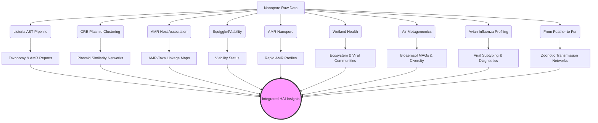

<div align="center">
  
# GenomicsForOneHealth
**A Bioinformatics Pipeline Collection for Genomic Surveillance & One Health**

[]()
[]()
[](https://opensource.org/licenses/MIT)

*Developed by the One Health group under the supervision of [Lara Urban](https://sites.google.com/view/urban-lab/home)*

</div>

---

## Overview

Using Nanopore technology and AI, we contribute to developing genomic surveillance strategies at the intersection of human, animal, and environmental health to empower our understanding of pathogens, their transmission, drug resistance, and virulence—in the context of food safety, water and air quality, and human clinical monitoring. Our research embraces the interdisciplinarity of One Health, and spans applications in the clinical, veterinarian, and environmental setting. By integrating portable technology and real-time AI analysis, we try to leverage genomics wherever it is needed—to improve health globally and holistically.

We are based at the University of Zurich and its Food Safety and One Health Institutes, with affiliations to the Helmholtz AI Institute. Our research has, amongst others, been funded by the German Ministry of Research, UK Research and Innovation, the New Zealand Department of Conservation, the European Union’s Horizon Europe, and the German Helmholtz Association.

As a signatory of the San Francisco Declaration on Research Assessment, we support fair and responsible research assessments and therefore discourage the inappropriate use of proxies such as journal impact factors.

Learn more about our work at the [Urban Lab website](https://sites.google.com/view/urban-lab/home).

### Our Team
- **Dr. Alber Perlas**: Virome and Avian Influenza Virus (AIV) 
- **Daniel Gygax**: eDNA Metabarcoding
- **Ela Sauerborn**: CRE Plasmid and Isolates
- **Harika Ürel**: Plasmid and Viability


## Integrated Pipelines

This repository currently hosts 9 distinct, yet complementary, analytical pipelines across 5 application domains:

### 🌍 1. Environmental Metagenomics

#### [Air Metagenomics Pipeline](./Environmental_Metagenomics/Air_Metagenomics/README.md)
*Air monitoring by nanopore sequencing for the detection of bioaerosol communities.*

#### [Wetland Health Analysis Pipeline](./Environmental_Metagenomics/Wetland_Health/README.md)
*Real-time genomic pathogen, resistance, and host range characterization from passive water sampling of wetland ecosystems.*

#### [Nanopore AMR Host Association Pipeline](./Environmental_Metagenomics/Nanopore-AMR-Host-Association/README.md)
*Direct linking of antimicrobial resistance genes to their bacterial hosts in metagenomic samples.*

---

### 🧫 2. Isolates & Plasmid Profiling

#### [AMR Nanopore Pipeline](./Isolates/AMR_nanopore/README.md)
*Rapid and reliable detection of Antimicrobial Resistance directly from nanopore sequencing data.*

#### [CRE Plasmid Clustering Pipeline](./Isolates/CRE-Plasmid-clustering/README.md)
*Advanced characterization and clustering of plasmids in Carbapenem-resistant Enterobacterales (CRE).*

---

### 🏥 3. Clinical Sequencing

#### [Listeria Adaptive Sampling Pipeline](./Clinical/Listeria-Adaptive-Sampling/README.md)
*High-resolution genomic analysis of Listeria monocytogenes from complex samples using Oxford Nanopore Adaptive Sampling.*

---

### 🦠 4. Virome & Diagnostics

#### [Avian Influenza Profiling Pipeline](./Virome/Avian-Influenza-Profiling/README.md)
*Rapid avian influenza profiling from Latest RNA and DNA nanopores.*

#### [From Feather to Fur Pipeline](./Virome/From_feather_to_fur/README.md)
*Variant calling workflow tracking transmission pathways from avian to mammalian hosts.*

---

### 🔬 5. Viability Assessment

#### [Squiggle4Viability Pipeline](./Viability/Squiggle4Viability/README.md)
*Assessing bacterial viability directly from raw nanopore electrical signals (FAST5/POD5).*

---

## Getting Started

To use these pipelines, clone the repository to your local environment:

```bash
git clone https://github.com/ttmgr/GenomicsForOneHealth.git
cd GenomicsForOneHealth
```

### Dependencies
We have centralized the environment and requirement files for this repository into the `envs/` directory. Each sub-pipeline also maintains specific container recommendations or additional instructions within its own directory:

*   [Listeria Setup Guide](./Clinical/Listeria-Adaptive-Sampling/docs/01_installation.md)
*   [CRE-Plasmid Setup Guide](./Isolates/CRE-Plasmid-clustering/README.md)
*   [AMR-Host Setup Guide](./Environmental_Metagenomics/Nanopore-AMR-Host-Association/README.md)
*   [Squiggle4Viability Setup Guide](./Viability/Squiggle4Viability/README.md) *(Requirements: `envs/squiggle4viability_requirements.txt`)*
*   [AMR Nanopore Setup Guide](./Isolates/AMR_nanopore/README.md)
*   [Wetland Health Setup Guide](./Environmental_Metagenomics/Wetland_Health/Installation_tutorial.md)
*   [Air Metagenomics Setup Guide](./Environmental_Metagenomics/Air_Metagenomics/Installation_tutorial.md) *(Environment: `envs/air_metagenomics_env.yaml`)*
*   [Avian Influenza Profiling Guide](./Virome/Avian-Influenza-Profiling/README.md)
*   [From Feather to Fur Guide](./Virome/From_feather_to_fur/README.md)

---

## Workflow Architecture



*(Note: The pipelines can be run independently or their outputs combined for detailed sample characterization.)*

---

## Contributing

We welcome contributions to improve and expand the GenomicsForOneHealth collection! 

1. Fork the repository.
2. Create your feature branch (`git checkout -b feature/AmazingFeature`).
3. Commit your changes (`git commit -m 'Add some AmazingFeature'`).
4. Push to the branch (`git push origin feature/AmazingFeature`).
5. Open a Pull Request.

---

## License

Distributed under the MIT License. See `LICENSE` for more information.

---

<div align="center">
  <i>"Empowering rapid response to infectious threats through advanced genomic surveillance."</i>
</div>
