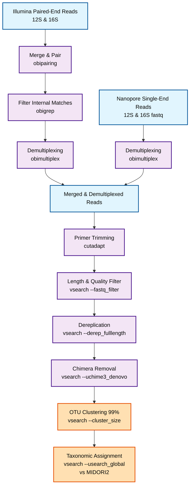

# Zambia eDNA Metabarcoding Pipeline

This repository contains the code and workflows used for environmental DNA research in Zambia. The pipeline covers merging and demultiplexing of Nanopore and Illumina sequencing data, read quality filtering, chimera removal, dereplication, and OTU clustering, followed by global alignment mapping against a reference database.

The original demultiplexing reference files and command parameters used for this pipeline are included for reproducibility.

 
  
