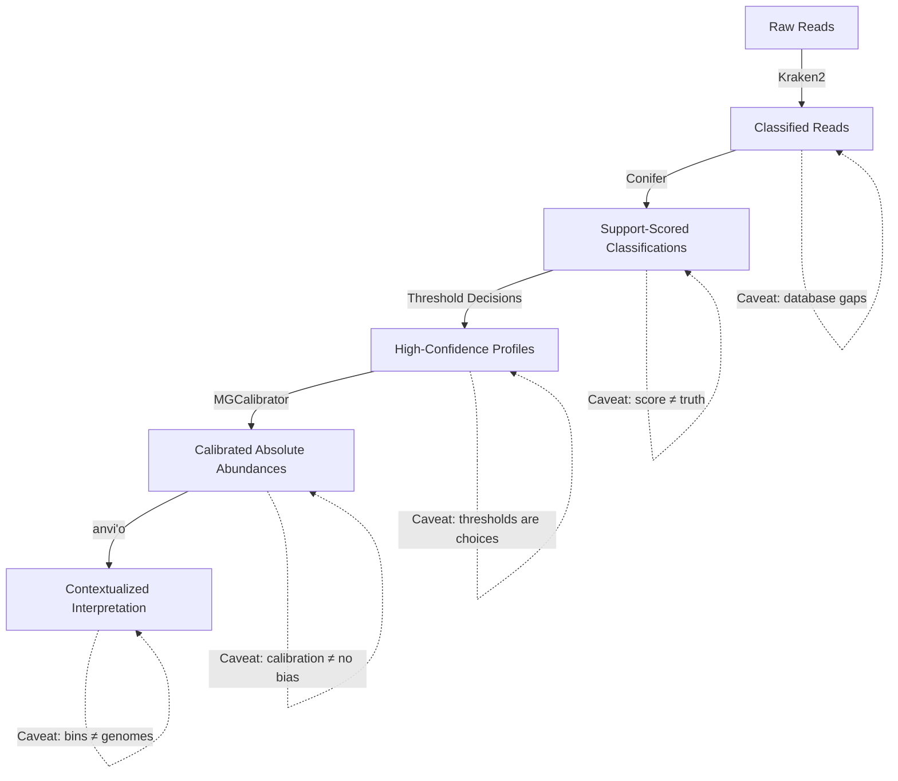

# From Classification to Calibration

A pipeline is not a list of tools. It is a chain of decisions, where each step inherits the assumptions and limitations of the step before it. This page traces one coherent path through metagenomic analysis—from raw classified reads to calibrated, interpretable results—and identifies the concerns that matter at each stage.

## Stage 1: Classify

**Tool:** Kraken2 (or equivalent k-mer classifier)

The starting point is taxonomic classification of sequencing reads against a reference database. Kraken2 is fast and widely used, but its output is only as meaningful as the database it matches against and the thresholds applied during classification.

At this stage, the key questions are:

- Is the database comprehensive enough for my sample type?
- What confidence threshold was applied, and what does it exclude?
- How many reads remain unclassified, and is that fraction acceptable or concerning?

**What can go wrong:** Low-abundance false positives from database contamination or k-mer collisions. Missing taxa because the database lacks representatives. Species-level calls where genus-level calls would be more honest.

## Stage 2: Evaluate Confidence

**Tool:** [Conifer](../tools/conifer.md)

Raw classification output treats every label equally. Conifer provides a second opinion by recomputing support scores from the k-mer evidence—confidence scores, RTL scores, and taxon-level quartile summaries.

This stage is about distinguishing well-supported classifications from noise. It is where you move from "Kraken2 said X" to "Kraken2 said X with this level of evidence."

At this stage, the key questions are:

- Which taxa have consistently high scores across their reads?
- Which taxa survive only because a few reads just barely crossed the threshold?
- Where should I draw filtering lines, and how sensitive are my conclusions to those choices?

**What can go wrong:** Over-aggressive filtering removes real but low-abundance taxa. Under-aggressive filtering lets false positives through. Choosing a single universal threshold instead of inspecting taxon-specific distributions.

See also: [Kraken2 Confidence Thresholds](../notes/kraken-confidence.md)

## Stage 3: Quantify

**Tool:** [MGCalibrator](../tools/mgcalibrator.md) (or coverage-based quantification generally)

Once you trust your taxonomic labels, the next question is: how much of each thing is actually there? Relative abundance answers "what fraction," but not "how much." Calibration against measured DNA mass converts dimensionless proportions into quantities with biological units.

At this stage, the key questions are:

- Is relative abundance sufficient for my analysis, or do I need absolute quantification?
- How accurately was the total DNA mass measured?
- How much uncertainty does the calibration introduce?

**What can go wrong:** Metadata mismatch between BAM filenames and mass measurements. Extraction bias inflating or suppressing specific taxa. Over-interpreting calibrated values without attending to their confidence intervals.

See also: [Absolute Abundance in Metagenomics](../notes/absolute-abundance.md)

## Stage 4: Contextualize

**Tool:** [anvi'o](../tools/anvio.md) (or equivalent integrated analysis platform)

Knowing *who* is there (Classification) with *what confidence* (Scoring) and *how much* of them (Calibration) still does not tell you *what they are doing* or *how they relate* to each other. Integrated analysis platforms like anvi'o provide the framework for functional annotation, pangenomics, phylogenomics, and visual exploration.

At this stage, the key questions are:

- What functional capabilities distinguish the organisms I found?
- How do MAGs or bins compare across samples or timepoints?
- What can interactive inspection reveal that automated summaries miss?

**What can go wrong:** Treating binning results as ground truth without interactive validation. Assuming that gene presence equals gene activity (a metagenome is not a metatranscriptome). Getting lost in the breadth of available analyses without a clear question.

## Stage 5: Interpret — With Caveats at Every Layer

The pipeline above is not automatic. Every transition involves a judgment call, and every stage carries assumptions that downstream stages cannot fully correct. The most important thing this pipeline teaches is that **metagenomic interpretation is not a computation—it is a series of decisions with consequences**.

## Why This Framing Matters

Together, Conifer, MGCalibrator, and anvi'o illustrate three distinct but complementary concerns in metagenomic analysis:

- **How confidently are reads labeled?** (Conifer)
- **How are relative observations converted into quantitative estimates?** (MGCalibrator)
- **How are multi-layer results organized, explored, and interpreted?** (anvi'o)

Presenting them as three layers of a stack—confidence, calibration, and integrated analysis—rather than as an unrelated list of tools is the whole point. Each layer addresses a different failure mode, and skipping any one of them weakens the interpretive foundation of the analysis.

## What I Would Test Next

- End-to-end benchmarking: take a mock community with known composition and known absolute abundances, run the full pipeline, and measure how close the final calibrated profiles match reality at each stage.
- Sensitivity analysis: vary Conifer score thresholds, MGCalibrator parameters, and binning strategies to understand which stage contributes most to final uncertainty.
- Long-read-specific evaluation: most of this pipeline was developed with short reads in mind. How does each tool's performance change with noisy long reads?

## Related Tools and Notes

- [Conifer](../tools/conifer.md) — post-classification scoring
- [MGCalibrator](../tools/mgcalibrator.md) — absolute abundance calibration
- [anvi'o](../tools/anvio.md) — integrated analysis ecosystem
- [Kraken2 Confidence Thresholds](../notes/kraken-confidence.md) — threshold discussion
- [Absolute Abundance in Metagenomics](../notes/absolute-abundance.md) — compositionality and quantification
