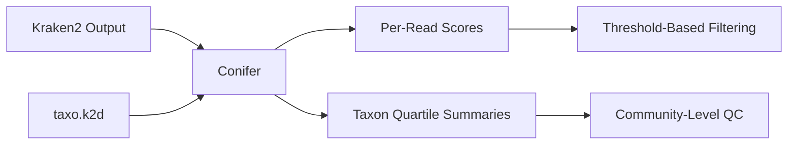

# Conifer

## What Conifer Adds Beyond Kraken2

[Conifer](https://github.com/Ivarz/Conifer) is a post-classification scoring utility for Kraken2 output. It does not classify reads itself; it takes the labels Kraken2 has already assigned and asks how well-supported those labels actually are.

Kraken2 is fast, but its output is binary in a way that can be misleading: a read is either assigned to a taxon or it is not. The built-in confidence threshold helps, but it is a single gate applied at classification time. What Conifer provides is the ability to recover and summarize richer score information *after* classification, so that downstream analysis can operate on support-aware taxonomic profiles rather than raw label counts.

This matters most in noisy environmental metagenomes—air, water, wastewater—where low-abundance false positives routinely survive default thresholds and can distort ecological interpretation.

## Input Requirements

Conifer consumes two things:

1. **Standard Kraken2 output** — the per-read classification file produced by any normal Kraken2 run.
2. **`taxo.k2d`** — the taxonomy index file from the Kraken2 database used for classification.

There is no separate database to build. If you have Kraken2 output and the corresponding database directory, you have what Conifer needs.

## Confidence vs RTL: Two Scoring Perspectives

Conifer computes two distinct score families, and understanding the difference between them is key to using the tool well.

### Confidence Score

The confidence score reflects how much of the k-mer evidence for a read supports the *assigned taxon and its descendants* in the taxonomy tree. A high confidence score means the classification is internally consistent: the k-mers agree with the label.

Think of it as asking: "Given the taxonomic path Kraken2 chose, how much of the evidence points in that direction?"

### RTL Score (Root-to-Leaf)

The RTL score takes a broader view. Instead of looking only at support for the assigned node, it considers the full classification tree path from root to the assigned leaf. This can surface cases where a read has strong support at higher taxonomic ranks but weak support at the species level—situations where a genus-level call might be trustworthy even when the species call is not.

The practical value of having both is that they expose different failure modes. A read can have a high confidence score but a mediocre RTL score (strong local support, weak path support), or vice versa. Using both together gives a more nuanced view of classification reliability than either alone.

## Paired-End Behavior

For paired-end data, Conifer supports per-read reporting as well as **average scores across mates**. This is useful because mate pairs often receive different classifications or different levels of support. Averaging smooths out mate-specific noise and provides a single, more stable score per fragment.

In practice, paired-end averaging reduces the number of ambiguous edge cases you need to handle downstream, which simplifies threshold-based filtering.

## Taxon-Level Summary Mode

Beyond per-read scoring, Conifer can summarize score distributions at the taxon level using **quartile statistics (P25 / P50 / P75)**. This is where the tool moves from read-level QC to something closer to community-level quality assessment.

A taxon where most reads have high confidence and high RTL scores is a taxon you can discuss with some assurance. A taxon where the median confidence is low and the interquartile range is wide is a taxon that probably should not survive into your final interpretation—or at least needs a flag.

This summary mode is especially valuable when exploring threshold decisions: rather than picking a single cutoff in the dark, you can inspect the score distributions of your most important taxa and make informed, taxon-specific choices.

## Where I Would Use This

Conifer is not something I would run on every dataset. It becomes valuable in specific situations:

- **Noisy environmental metagenomes** where species-level calls from Kraken2 need scrutiny before ecological interpretation.
- **Long-read taxonomic profiling** where classification confidence interacts with read length and error profile in non-obvious ways.
- **Threshold exploration** when I need to decide how aggressively to filter and want evidence beyond gut feeling.
- **Post hoc QC** of published or shared Kraken2 results where the original thresholds are unknown or suspect.

In my own workflow, this sits between Kraken2 and any downstream abundance or diversity analysis. It is the step where raw labels become support-aware labels.

## Caveats

- **Conifer cannot rescue a bad database.** If the Kraken2 database lacks relevant references, no amount of score recalculation will produce correct taxonomy. Garbage in, scored garbage out.
- **Higher scores do not guarantee correctness.** A read can be confidently assigned to the wrong taxon if the true organism is absent from the database. Conifer measures internal consistency of classification, not biological truth.
- **Score thresholds still require empirical validation.** There is no universal cutoff. What works for a wastewater metagenome may be too aggressive for a soil sample with high novel diversity.
- **Narrowness is a feature.** Conifer does one thing well. It does not try to be a classifier, a profiler, or an analysis platform. That is why it is trustworthy for its specific purpose.

## Implementation Notes

The codebase is small, compiled C, with a clean separation between taxonomy parsing, score computation, statistics, and CLI handling. This makes Conifer worth noting not only as a tool but as an example of how a focused bioinformatics utility can be built: inspectable, testable, and easy to reason about.

Licensed under **BSD-2-Clause**.

## Related Resources

- [Conifer GitHub](https://github.com/Ivarz/Conifer) — source code and usage documentation
- [Kraken2 Manual](https://github.com/DerrickWood/kraken2/wiki) — background on confidence thresholds and classification
