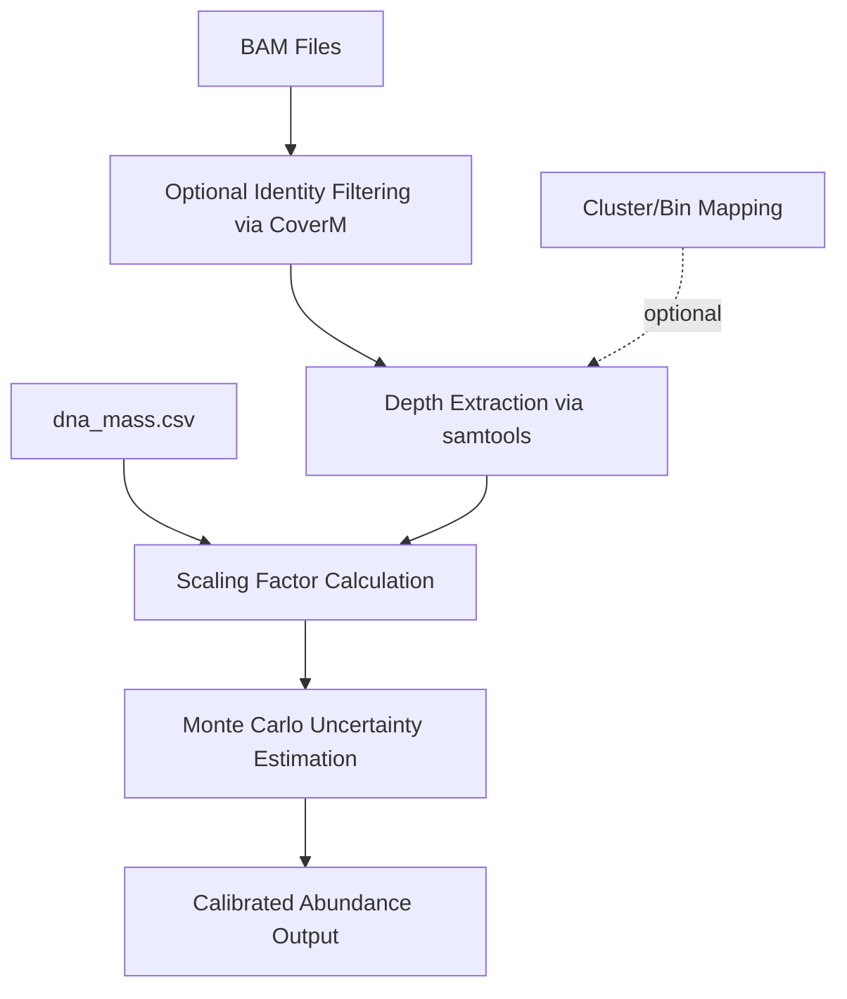

# MGCalibrator

## Why Absolute Abundance Matters

Relative abundance profiles are the default output of most metagenomic classifiers, but they carry a fundamental limitation: they are compositional. If one taxon blooms, every other taxon's relative abundance drops, even if their actual load has not changed. This means that relative profiles can mask biologically important shifts—a pathogen doubling in absolute terms might appear stable or even declining if the rest of the community is also growing.

This compositionality problem is not academic. It matters directly in wastewater surveillance, AMR monitoring, and any time-series study where the question is "Is there more of this organism?" rather than "What fraction of the community is this organism?"

[MGCalibrator](https://github.com/NimroddeWit/MGCalibrator) addresses this by anchoring metagenomic coverage to physical DNA mass, producing calibrated absolute abundances rather than dimensionless proportions.

## What MGCalibrator Actually Calibrates

The tool takes sequencing-derived coverage depth and rescales it using empirically measured DNA mass and the total amount of sequenced material. The result is a set of **sample-specific scaling factors** that convert raw depth into an estimate of biological load.

The conceptual model is straightforward: if you know how much DNA you extracted, how much you sequenced, and how deeply each reference was covered, you can back-calculate an absolute quantity. The practical value is that samples become quantitatively comparable—not just in terms of relative rank, but in terms of actual abundance.

## Input Files and Assumptions

MGCalibrator expects:

| Input | Description |
|---|---|
| **BAM files** | One per sample, containing aligned reads against reference sequences |
| **`dna_mass.csv`** | Measured DNA quantities per sample (e.g., from Qubit fluorometry) |
| **Cluster/bin mapping** *(optional)* | Files mapping references to groups for aggregated quantification |
| **Output directory** | Where calibrated results will be written |

> [!WARNING]
> **Filename-dependent sample handling.** The parser module (`parser.py`) couples sample identity to BAM filenames. Inconsistent naming will silently produce incorrect sample groupings. Metadata hygiene is not optional here—it is part of quantitative reproducibility.

## Workflow: From BAM to Calibrated Depth

1. **Discover BAM files** in the specified folder.
2. **Optionally filter reads** by minimum percent identity using CoverM, discarding poorly mapped reads before quantification.
3. **Extract depth** using `samtools depth -a`, retaining zero-coverage positions to avoid inflating mean depth.
4. **Compute scaling factors** from the ratio of sequenced depth to measured DNA mass.
5. **Propagate uncertainty** through Monte Carlo simulation rather than reporting calibrated depth as a point estimate.
6. **Write outputs** with both raw and calibrated values, including error ranges.

## The Uncertainty Model

This is the part worth paying attention to. MGCalibrator does not pretend calibrated abundance is exact. It uses **Monte Carlo simulation** to propagate measurement uncertainty through the calibration, producing confidence intervals alongside point estimates.

The output columns, in plain language:

- **Raw depth** — what the sequencer saw, uncalibrated.
- **Uncertainty on raw depth** — how variable that estimate is.
- **Calibrated depth** — raw depth rescaled by the sample-specific scaling factor.
- **Uncertainty on calibrated depth** — how much the calibration itself contributes to imprecision.

This is honest quantification. It tells you what you measured *and* how much you should trust it.

## Clusters, Bins, and Reference-Level Aggregation

MGCalibrator can operate at three levels of granularity:

- **Individual references** — each reference sequence gets its own calibrated depth.
- **Clusters** — references are grouped by similarity, with depth summarized using the shortest reference in the cluster as the size anchor.
- **Bins** — references are grouped by binning results (e.g., from metagenomic binning), with depth aggregated across positional displacements.

This flexibility means the tool can plug into workflows that operate at the contig level, the MAG level, or somewhere in between.

## Where This Would Help in Wastewater and AMR Monitoring

The strongest use case for MGCalibrator is any setting where you need to track *changes in load* over time, not just changes in composition:

- **Wastewater surveillance** where you want to know whether ARG copy numbers are increasing, not just whether their relative rank shifted.
- **Time-series environmental monitoring** where a compositionality-blind analysis might miss a genuine pathogen bloom.
- **Cross-sample comparisons** where differing extraction yields make raw coverage incomparable without calibration.

In my own work, this is the step where metagenomic results stop being "who is there" and start answering "how much is there"—which is often the more actionable question.

## Failure Points to Watch

- **Metadata mismatch.** If BAM filenames, DNA mass entries, and sample identifiers are not perfectly aligned, the calibration will silently produce wrong scaling factors for wrong samples.
- **Extraction bias.** MGCalibrator calibrates sequencing signal against input DNA mass. It does not correct for differential extraction efficiency across organisms. If Gram-positives lyse poorly, their calibrated abundance will still underestimate reality.
- **Reference bias.** Coverage depends on reference quality. Poorly represented taxa in the reference database will appear less abundant than they truly are, and calibration does not fix that.
- **Mapping bias.** Read mapping stringency affects depth. Too permissive and you get inflated depth from misaligned reads; too strict and you lose real signal.
- **Over-interpretation.** A calibrated number with a wide confidence interval is not a precise measurement. Treat the uncertainty estimate as the actual result, not just the point value.

## Limitations and Open Questions

MGCalibrator is a promising and practical tool, but it is worth being clear about what it does not do:

- It does not remove extraction, library prep, or amplification biases.
- It does not infer absolute cell counts—it infers calibrated DNA depth, which is a different quantity.
- The approach works best when DNA mass measurements are accurate; errors in benchtop fluorometry propagate linearly into the final estimates.
- The project is relatively young. It is not yet widely adopted or extensively benchmarked across diverse sample types.

The safest framing: MGCalibrator provides a **principled, uncertainty-aware bridge between relative metagenomic signal and quantitative interpretation**. It is not a magic converter from reads to biology, but it is a significant improvement over treating raw coverage as if it were a meaningful quantity.

## Implementation Notes

The codebase is a modular Python package:

- `cli.py` — orchestrates BAM discovery, filtering, depth estimation, scaling, and output.
- `fileutils.py` — file path handling and I/O.
- `parser.py` — sample identification from filenames (the source of the naming dependency).
- `processor.py` — depth computation, scaling factor calculation, and Monte Carlo simulation.

External dependencies: `samtools`, `coverm`, `pandas`, `numpy`, `pysam`.

Licensed under **MIT**.

## Related Resources

- [MGCalibrator GitHub](https://github.com/NimroddeWit/MGCalibrator) — source code, installation, and usage documentation
- [Aitchison (1986) — The Statistical Analysis of Compositional Data](https://doi.org/10.1007/978-94-009-4109-0) — foundational reference on compositionality in proportion data
