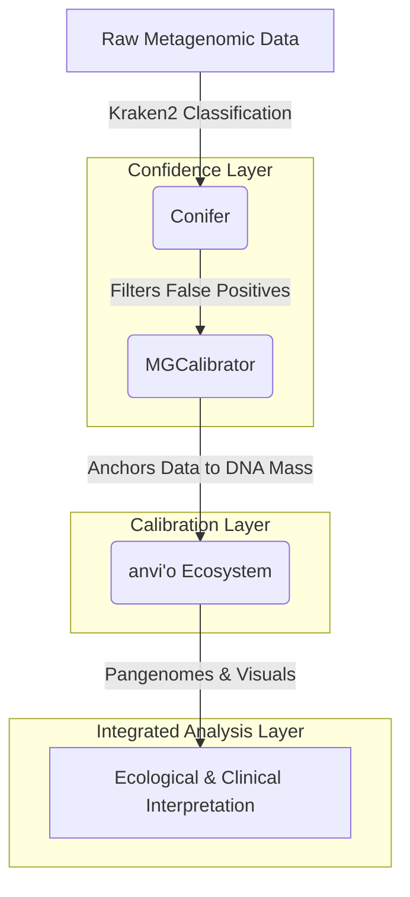

# The Metagenomic Analysis Stack: A Three-Layer Strategy

Our analytical methodology treats metagenomic processing not as a monolithic pipeline, but as a stack composed of three distinct functional layers: **Confidence, Calibration, and Integrated Analysis**. 

By modularizing these responsibilities, we ensure that ecological interpretations are based on high-quality, quantitative data rather than noisy relative read counts. 

## 1. The Confidence Layer: [Conifer](./conifer.md)
**Goal:** Filter noise and validate taxonomic calls.

We use **Conifer** immediately after initial fast k-mer classification (Kraken2) to calculate read-to-length and confidence scores. This step ensures that downstream analyses are not hijacked by low-abundance false positives, keeping our taxonomic profiles clean and deliberate.

## 2. The Calibration Layer: [MGCalibrator](./mgcalibrator.md)
**Goal:** Convert relative percentages to absolute biological quantities.

Relative abundances can mask true biological shifts (e.g., a pathogen blooming without changing its relative rank due to a parallel bloom in commensals). **MGCalibrator** bridges BAM files with benchtop DNA mass measurements, applying scaling factors with Monte Carlo-derived confidence intervals to yield absolute abundances.

## 3. The Integrated Analysis Layer: [anvi'o](./anvio.md)
**Goal:** Deep structural and functional contextualization.

Once we know exactly *who* is there (Conifer) and *how much* of them is there (MGCalibrator), we use **anvi'o** to ask *what they are doing*. As a comprehensive ecosystem, anvi'o allows us to generate pangenomes, map coverage across contig databases, and interactively explore microbial relationships.

## Philosophy
This repository serves as a personal technical notebook with judgment. We do not mirror upstream tool documentation; we document *why* we use these tools, *how* they connect, and what assumptions we accept when running them on real-world clinical and environmental samples.
